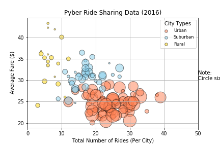
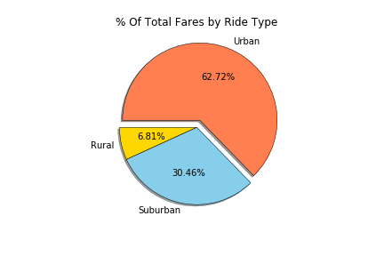

# Pyber-matplotlib
Built a Bubble Plot that showcases the relationship between four key variables:

Average Fare Per City
Total Number of Rides Per City
Total Number of Drivers Per City
Total City Type 

Also produced the following three pie charts:

% of Total Fares by City Type
% of Total Rides by City Type

% of Total Drivers by City Type

Used the Pandas Library and the Jupyter Notebook.
Used the Matplotlib library.

